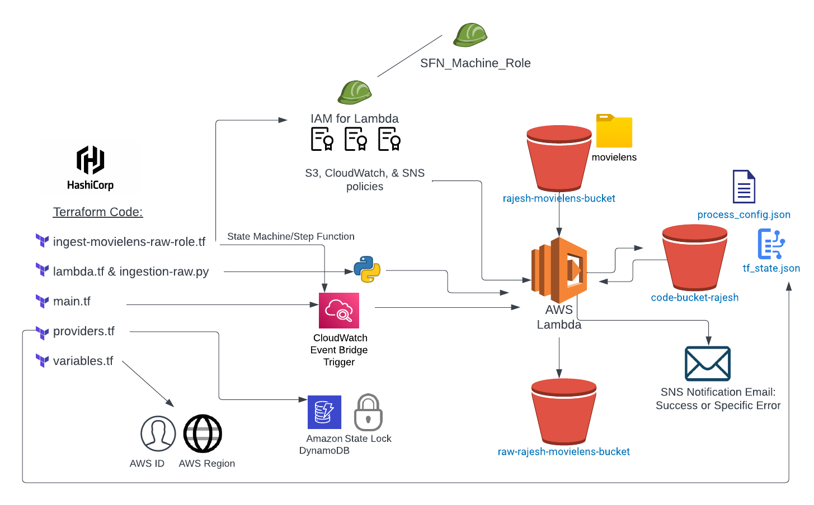

# data_file_ingestion

Project Description: 
The goal of this project was to develop infrastracurre code which, when launched, will transfer data from a "source" S3 bucket to a
"raw" S3 bucket while keeping track of the transfer date. This operation is a part of a larger picutre, whivh involves moving the data from the "raw" bucket to
the staging environment, and ultimateley to the "data lake." In practice, this process is organizing and properly structuring data for analysis. 

[Process Flow](rajesh_data_ingestion_project.png)

Steps Taken & File Structure Details:

1. Created the following S3 buckets in the AWS console: "rajesh-movielens-bucket" , "raw-rajesh-movielens-bucket" , & "code-bucket-rajesh"

2. Uploaded the "movielens" folder into "rajesh-movielens-bucket" with all of our sample data. At this point I also uploaded a configuration file,
   "process_config.json" into the "code-bucket-rajesh." This file will be referred to later in the Lambda function and will instruct the python code
   on which buckets to transfer the data between, and also where exactly the data is located.
   
3. Developed a file strucutre, with the parent file named "data_ingestion_project" and subfolders "src" & "terraform." Within the "src" folder,
   we have the "config" & "ingestion_lambda_function" subfolders. The "config" folder holds the "config.json file", while the "ingestion_lambda_function"
   contains the "ingestion-raw.py" file. As described later, the "config.json file" will be called upon in the "ingestion-raw.py" file. 
   
   The "ingestion-raw.py" defines the lambda function:
   
   -The necessary imports are made, including the datetime module for date and time manipulation, boto3 for AWS service interactions, json for working with JSON data, os for accessing environment variables, and logging for logging messages.
   
   -The current date is obtained using datetime.now() and the year, month, and day values are extracted.
   
   -The script retrieves the values of two environment variables: code_bucket and sns_topic_notifications. The code_bucket value is printed.
   
   -The s3, s3_client, and sns_client objects are created using the boto3 library to interact with AWS S3 and SNS services.
   
   -Logging configurations are set up, specifying the log level and format.
   
   -The publish_sns_message function is defined, which publishes a message to an SNS topic using the sns_client.publish method.
   
   -The lambda_handler function is defined, which is the entry point for the Lambda function. It takes in an event and context parameter.
   
   -Within the lambda_handler function, several operations are performed. First, the data_set value is extracted from the event parameter and logged.
   
   -An attempt is made to retrieve an object from the S3 bucket specified by code_bucket and the data_set value. If successful, the data is read and processed further.
   
   -Next, the configuration data is extracted from the retrieved object, including the source and target S3 bucket names.
   
   -A list of objects in the source S3 bucket is obtained using the list_objects_v2 method, and file names are extracted from the response.
   
   -A loop iterates through the file list, performing operations on each file. A copy of each file is made in the target S3 bucket with a modified key, incorporating the current date and file extension.
   
   -After the file processing loop, a success message is published to the SNS topic.
   
   -Finally, a response is returned from the Lambda function, indicating success or failure with an appropriate status code and message.
   
   ----
   
   The remaining steps will desribe our infrastructure code as established by the files within the "terraform" folder:
   
 4. ingest-movielens-raw-role.tf: The code defines a data source for an IAM policy document that allows an AWS Lambda function to assume a role. It also creates an IAM role named "state_machine_role" with an assume role policy that allows the AWS Step Functions service to assume the role. Another data source is defined for an IAM policy document that grants permissions related to CloudWatch Logs, S3, and SNS. The code then creates an IAM role named "iam_for_lambda" with the assume role policy obtained from the data source. It attaches a CloudWatch policy to this role and creates an S3 policy as well. The S3 policy is attached to the "iam_for_lambda" role. Additional policies, such as "lambda-execution" and "sns_policy_attachment", are attached to the respective roles. The code also creates an SNS topic and a subscription to receive updates. Lastly, it creates an AWS Step Functions state machine named "sfn_state_machine" with a specific definition that includes invoking a Lambda function.
    
 5. lambda.tf: This code creates an AWS Lambda function. The code first creates a zip archive file using the data.archive_file block, which 
    specifies the source file and output path for the zip file. The aws_lambda_function resource then uses this zip file as its source code, 
    along with other configuration parameters such as the function name, IAM role, handler function, runtime (Python 3.10), and timeout (900 
    seconds). It also defines ephemeral storage size and environment variables for the Lambda function, including a code bucket name and an SNS 
    topic for notifications.
    
 6. main.tf: This code sets up an AWS CloudWatch Event Rule to trigger a Lambda function. The aws_cloudwatch_event_rule resource defines a 
    rule named "nightly_lambda_trigger" with a description and a schedule expression set to run every night at 8 PM. 
    The aws_cloudwatch_event_target resource associates the previously created CloudWatch Event Rule with a specific Lambda function 
    identified by its ARN. The target ID is set as "ingest-movielens-raw".
  
  7. providers.tf: This code sets up the AWS provider configuration, specifies the required Terraform version and providers, and configures the Terraform 
     backend for storing state. The provider "aws" block sets the AWS region based on the value of the aws_region variable. The first terraform 
     block specifies the required Terraform version and defines the required random provider with a version of 3.0.1. The second terraform block 
     configures the backend to use an S3 bucket named "code-bucket-rajesh" for storing the Terraform state. 
     It also specifies a DynamoDB table named "terraform_state_lock" for state locking and sets the key path and region for the state file.

 8.  variables.tf: This code defines two variables. The variable "aws_region" represents the desired AWS region and has a default value of "us-east-2". 
     It is of type string and includes a description. The variable "account_id" represents the AWS account ID and has a default value of 
     "867838412845".
